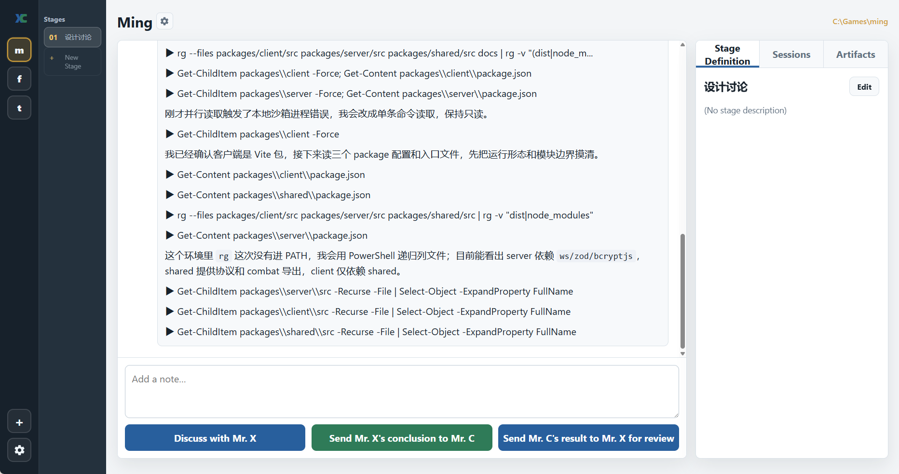

# Mr C & Mr X

> **Cursor writes. Codex reviews. You decide.**

Mr C & Mr X is a local-first developer workflow tool for people who already use more than one AI coding agent.

It creates a lightweight project room where:

- **Mr C** is the implementer. In the default setup, Mr C is powered by Cursor.
- **Mr X** is the reviewer and architect. In the default setup, Mr X is powered by Codex.
- **You** are the lead. You decide when to move forward, what to accept, and what to reject.

The goal is not full automation. The goal is controlled collaboration:

> AI does 80% of the work.  
> You make the calls at the important moments.

---

## Screenshots

> TODO: Replace these placeholders with real screenshots before publishing.

### Project room

<!-- Screenshot placeholder:
docs/images/project-room.png

Suggested screenshot:
A room view showing:
- user message
- Mr X analysis
- Mr C implementation report
- current status
- action buttons
-->



### Review flow

<!-- Screenshot placeholder:
docs/images/review-flow.png

Suggested screenshot:
A review screen showing:
- Mr C changed files
- git diff summary
- Mr X review with Must Fix / Should Fix / Nice to Have
- user selection of accepted items
-->


### CLI demo

<!-- Screenshot placeholder:
docs/images/cli-demo.png

Suggested screenshot:
Terminal running:
npm run mrcx -- start "..."
npm run mrcx -- next
npm run mrcx -- status
-->


---

## Why this exists

AI coding tools are getting better at writing code, but real development is rarely just "ask one agent to do everything".

A common workflow today is:

1. Ask Cursor to make changes.
2. Ask Codex to review the result.
3. Copy Codex feedback back into Cursor.
4. Ask Cursor to fix.
5. Repeat.

That workflow is powerful, but the manual copy/paste is annoying, and the important context gets scattered.

Mr C & Mr X turns that pattern into a repeatable workflow:

```text
You describe the task
  ↓
Mr X analyzes and gives guidance
  ↓
You approve or adjust
  ↓
Mr C implements
  ↓
Mr X reviews the diff
  ↓
You choose what to accept
  ↓
Mr C fixes
  ↓
You finish, commit, or continue
```

---

## Core idea

Mr C & Mr X is not another IDE and not another coding model.

It is a coordination layer for AI coding tools.

```text
Mr C = the hands
Mr X = the eyes and brain
You  = the decision maker
```

The most important product principle:

```text
Human-in-the-loop by default.
```

The tool should make it easy to continue, but it should not silently run an endless autonomous loop.

---

## Current status

This project is in an early prototype stage.

The current codebase already contains the building blocks for:

- a local command adapter for end-to-end testing without Cursor or Codex;
- a Codex wrapper for Mr X read-only actions;
- helper scripts to enable local and Codex-backed agents;
- Codex binary resolution on Windows and npx fallback;
- Cursor Agent probing and Windows shim helpers;
- smoke probes for Codex and Cursor session creation / resume;
- clearer Codex failure hints for timeout, missing binary, stream disconnect, and non-zero exits.

The immediate goal is to stabilize the CLI workflow before building a polished app UI.

---

## How it works

At a high level, a room has:

- a selected project directory;
- a task;
- messages from you, Mr C, Mr X, and the system;
- generated prompts;
- agent outputs;
- artifacts such as diffs, logs, and file lists;
- decisions such as accepted or rejected review items;
- a current state.

A typical state flow looks like this:

```text
NEW_TASK
  ↓
X_ANALYZE
  ↓
WAIT_USER_APPROVAL
  ↓
C_IMPLEMENT
  ↓
X_REVIEW
  ↓
WAIT_USER_DECISION
  ↓
C_FIX
  ↓
X_FINAL_CHECK
  ↓
DONE
```

---

## Roles

### You

You are the project lead.

You decide:

- what task to start;
- whether Mr C should write;
- whether Mr X should review;
- which review items to accept;
- whether to continue, stop, or finish.

### Mr C

Mr C is the implementer.

Mr C may:

- modify code;
- update docs;
- run tests;
- explain implementation choices;
- fix accepted review items.

Mr C should not:

- silently expand scope;
- ignore accepted review items;
- continue indefinitely without user approval.

### Mr X

Mr X is the reviewer and architect.

Mr X may:

- summarize the task;
- analyze risks;
- suggest an implementation plan;
- review Mr C's diff;
- separate findings into Must Fix, Should Fix, and Nice to Have;
- give the next instruction for Mr C.

Mr X should not modify files by default.

---

## Features

### Local agent adapter

Use the local agent when you want to test the full workflow without real Cursor or Codex integration.

```bash
node scripts/enable-local-agent.mjs
```

Then run a room:

```bash
npm run mrcx -- start "Try the local Mr C and Mr X loop" --no-worktree
npm run mrcx -- next
npm run mrcx -- status
```

### Codex-backed Mr X

Enable Codex as the Mr X reviewer / architect:

```bash
node scripts/enable-codex-x-agent.mjs
```

Run a dry check:

```bash
node scripts/enable-codex-x-agent.mjs --dry-run-check
```

The Codex wrapper is intentionally X-only. It supports review and analysis actions such as:

```text
X_ANALYZE
X_REVIEW
X_FINAL_CHECK
X_FINAL_OPINION
```

C actions should remain on the Cursor, local, or mock adapter.

### Codex invocation resolution

Codex can be resolved through:

1. `MRCX_CODEX_BIN`
2. Windows LocalAppData Codex install
3. `codex` from PATH with prefix args
4. `npx --yes @openai/codex`

Useful environment variables:

```bash
MRCX_CODEX_BIN=/path/to/codex
MRCX_CODEX_PREFIX_ARGS=
MRCX_CODEX_SANDBOX=read-only
MRCX_CODEX_APPROVAL=never
MRCX_CODEX_EPHEMERAL=1
MRCX_CODEX_MODEL=
MRCX_CODEX_EXTRA_ARGS=--skip-git-repo-check
MRCX_CODEX_VERBOSE=1
```

### Cursor Agent helpers

For Windows environments where the default Cursor Agent PowerShell shim is broken, the repository includes helper scripts to resolve and run the local Cursor Agent installation.

Examples:

```powershell
.\scripts\v2-cursor-agent.ps1 status
node scripts/v2-probe-cursor.mjs
```

### Smoke probes

Codex probe:

```bash
node scripts/v2-probe-codex.mjs
```

Cursor probe:

```bash
node scripts/v2-probe-cursor.mjs
```

These probes are useful for validating whether your local agent installations can create and resume sessions.

---

## Installation

> TODO: Adjust this section after the final package name and package manager scripts are confirmed.

Clone the repository:

```bash
git clone https://github.com/<your-org>/<your-repo>.git
cd <your-repo>
```

Install dependencies:

```bash
npm install
```

Initialize Mr C & Mr X in a project:

```bash
npm run mrcx -- init /path/to/project
```

Start a room:

```bash
cd /path/to/project
npm run mrcx -- start "Describe the task here" --no-worktree
```

Continue the next recommended step:

```bash
npm run mrcx -- next
```

Check status:

```bash
npm run mrcx -- status
```

---

## Suggested first run

For the safest first run, use the local agent:

```bash
node scripts/enable-local-agent.mjs
npm run mrcx -- start "Test the Mr C and Mr X workflow" --no-worktree
npm run mrcx -- next
npm run mrcx -- next
npm run mrcx -- status
```

After that, enable Codex for Mr X:

```bash
node scripts/enable-codex-x-agent.mjs --dry-run-check
node scripts/enable-codex-x-agent.mjs
npm run mrcx -- start "Ask Mr X to analyze this project" --no-worktree
npm run mrcx -- next
```

---

## CLI command ideas

> Some commands may still be evolving. Treat this section as the intended public interface.

```bash
npm run mrcx -- init /path/to/project
npm run mrcx -- start "Task description"
npm run mrcx -- next
npm run mrcx -- status
npm run mrcx -- diff refresh
npm run mrcx -- x analyze
npm run mrcx -- c implement
npm run mrcx -- x review
npm run mrcx -- c fix
npm run mrcx -- finish
```

---

## Design principles

### 1. Cursor writes. Codex reviews. You decide.

This is the core workflow. Mr C changes the project. Mr X checks and guides. You approve, reject, or edit the next step.

### 2. Human-in-the-loop by default

The tool should reduce repetitive copying and pasting, not remove human judgment.

### 3. Local-first

Project files, prompts, outputs, decisions, and artifacts should be stored locally by default.

### 4. Artifacts are first-class

A useful room is not just a chat transcript. It should also keep:

- generated prompts;
- agent outputs;
- git diffs;
- test logs;
- file lists;
- review decisions;
- final summaries.

### 5. Small steps beat giant autonomous runs

Prefer short, reviewable turns:

```text
Analyze → implement → review → choose → fix
```

### 6. Mr X is read-only by default

Mr X should review and guide. Direct file modification by Mr X should be an explicit advanced mode, not the default.

---

## Security and privacy

Mr C & Mr X is designed to be local-first, but the actual privacy properties depend on the agents you configure.

Please remember:

- Cursor and Codex may send code or prompts to their respective services depending on their own settings and terms.
- Do not include secrets in prompts.
- Review generated prompts before sharing sensitive project context.
- Use git branches or worktrees for agent-driven changes.
- Keep Mr X read-only unless you explicitly want it to modify files.
- Inspect diffs before committing.

Recommended workflow:

```bash
git status
git diff
npm test
```

Then commit manually.

---

## Project structure

The current prototype includes scripts such as:

```text
scripts/
  codex-errors.mjs
  codex-spawn-args.mjs
  enable-codex-x-agent.mjs
  enable-local-agent.mjs
  mrcx-codex-agent.mjs
  mrcx-local-agent.mjs
  resolve-codex-bin.mjs
  v2-probe-codex.mjs
  v2-probe-cursor.mjs
  v2-resolve-cursor-agent.mjs
```

Suggested long-term structure:

```text
packages/
  core/
  cli/
  web/
  adapters/
    codex/
    cursor/
    local/
scripts/
docs/
examples/
```

---

## Roadmap

### Milestone 1: Stable CLI loop

- local adapter
- Codex Mr X adapter
- room state
- generated prompts
- stored outputs
- diff collection
- status and next commands

### Milestone 2: Real Mr C integration

- Cursor Agent adapter
- persistent chat / resume support
- safer write boundaries
- better error recovery

### Milestone 3: Review decisions

- parse Must Fix / Should Fix / Nice to Have
- allow user to select accepted items
- generate a focused Mr C fix prompt
- store accepted and rejected decisions

### Milestone 4: Project room UI

- local web or desktop app
- three-person conversation view
- diff panel
- review checklist
- action buttons
- room history

### Milestone 5: Ecosystem

- adapter SDK
- workflow templates
- custom roles
- community examples

---

## Contributing

Contributions are welcome.

Good first areas:

- improve README and examples;
- test on Windows / macOS / Linux;
- improve Cursor Agent detection;
- improve Codex error hints;
- add more smoke tests;
- add sample workflows;
- improve prompt templates;
- document real-world usage.

Before opening a PR, please include:

- what workflow you tested;
- your OS;
- your Node.js version;
- whether you used local, Cursor, or Codex adapters.

---

## FAQ

### Is this trying to replace Cursor or Codex?

No.

Mr C & Mr X coordinates existing AI coding tools. It is a project room and workflow layer.

### Why not make it fully automatic?

Because in real development, judgment matters. The goal is to automate the boring 80% while keeping you in control of scope, review, and final decisions.

### Can I use different agents?

The long-term goal is yes. Cursor and Codex are the default mental model, but the adapter layer should make it possible to support other tools.

### Does Mr X write code?

Not by default. Mr X reviews and guides. Mr C writes.

### Why the name?

Because the product is easier to understand as a relationship than as a platform:

```text
Mr C writes.
Mr X reviews.
You decide.
```

---

## License

Apache License 2.0. See [LICENSE](LICENSE).

---

## Brand note

The code is open source under the Apache License 2.0.

The names "Mr C & Mr X" and "C先生 & X先生", plus any project logos or visual assets, are brand identifiers of the project maintainers. Please do not present forks or modified versions as the official project.
